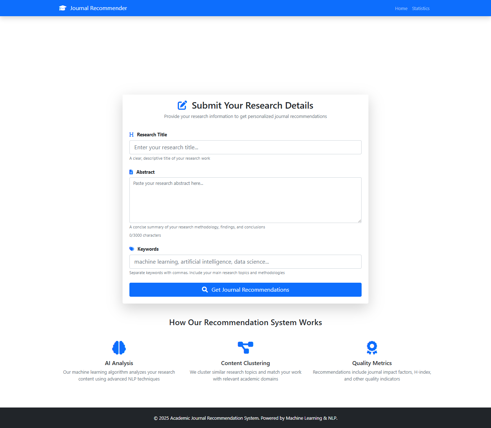
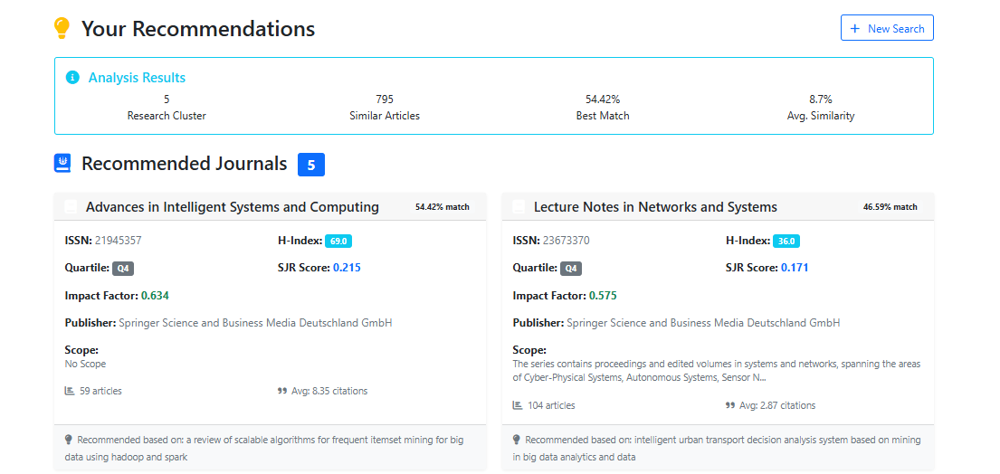
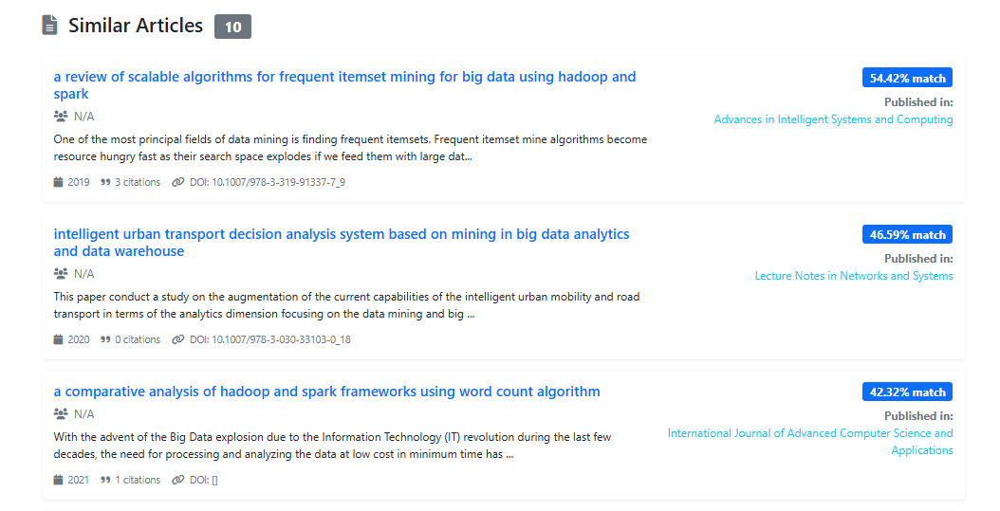
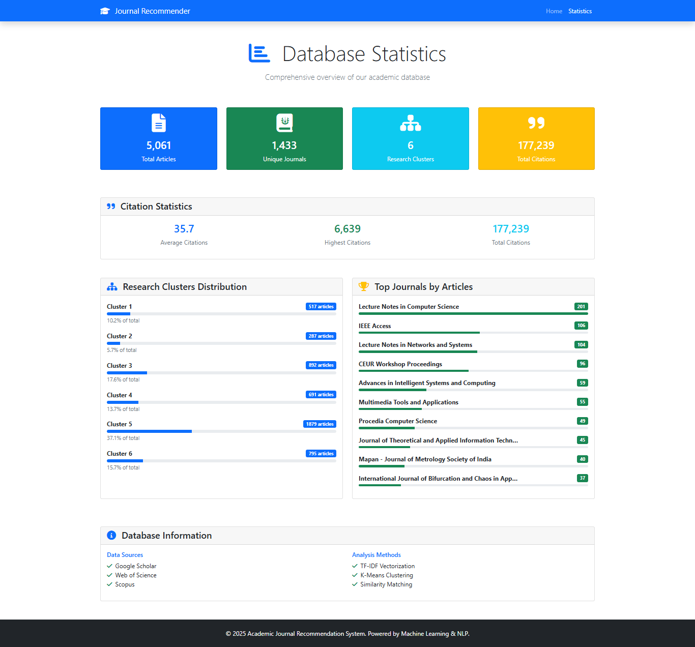

# Academic Journal Recommendation System

A comprehensive data integration and machine learning project that provides intelligent journal recommendations for academic researchers. The system uses TF-IDF vectorization and K-Means clustering to analyze research papers and suggest the most suitable journals for publication.

## 🚀 Features

- **Smart Journal Recommendations**: Uses machine learning to suggest journals based on research content
- **Comprehensive Journal Information**: Displays detailed metrics including H-index, impact factor, SJR scores, and quartile rankings
- **Similar Article Discovery**: Finds related research papers in the database
- **Interactive Statistics Dashboard**: Provides insights into database metrics and research clusters
- **Modern Web Interface**: Clean, responsive design built with Bootstrap 5
- **Multi-Database Integration**: Combines data from Google Scholar, Web of Science, and Scopus

## � Screenshots

### Homepage

*Clean and intuitive interface for entering research descriptions*

### Journal Recommendations

*Comprehensive journal recommendations with detailed metrics*

### Article Recommendations

*Similar articles and research cluster analysis*

### Statistics Dashboard

*Interactive dashboard with database insights and analytics*

## �📊 Project Structure

```
Data-Integration/
├── app.py                      # Main Flask web application
├── Articles_clustered.csv      # Processed articles dataset with cluster assignments
├── journal_info.csv           # Journal metadata and metrics
├── kmeans_model.pkl           # Trained K-Means clustering model
├── tfidf.pkl                  # TF-IDF vectorizer for text processing
│
├── templates/                 # HTML templates
│   ├── index.html            # Homepage with search interface
│   ├── results.html          # Recommendation results page
│   └── stats.html            # Statistics dashboard
│
├── static/                   # Static assets
│   └── styles.css           # Custom CSS styles
│
├── notebooks/               # Jupyter notebooks for data processing
│   ├── MatchingMapping.ipynb    # Data integration and mapping
│   ├── model.ipynb             # Machine learning model training
│   ├── preprocessing.ipynb     # Data preprocessing pipeline
│   ├── scopus_scraper.ipynb    # Scopus data collection
│   ├── wos_scraper.ipynb       # Web of Science data collection
│   └── gs.ipynb               # Google Scholar data processing
│
└── README.md               # Project documentation
```

## 🛠️ Technology Stack

- **Backend**: Flask (Python web framework)
- **Machine Learning**: scikit-learn, pandas, numpy
- **Natural Language Processing**: NLTK
- **Frontend**: Bootstrap 5, Font Awesome, HTML5/CSS3
- **Data Processing**: Jupyter Notebooks, pandas
- **Model Persistence**: joblib

## 📋 Requirements

```
Flask>=2.0.0
pandas>=1.3.0
scikit-learn>=1.0.0
nltk>=3.6
numpy>=1.21.0
joblib>=1.0.0
```

## 🚀 Installation & Setup

### 1. Clone the Repository
```bash
git clone https://github.com/Youness331/Academic-Recommendation-System.git
cd Data-Integration
```


### 2. Install Dependencies
```bash
pip install flask pandas scikit-learn nltk numpy joblib
```

### 3. Download NLTK Data
```python
python -c "import nltk; nltk.download('punkt'); nltk.download('stopwords'); nltk.download('wordnet')"
```

### 4. Run the Application
```bash
python app.py
```

The application will be available at `http://localhost:5000`

## 📖 How to Use

### 1. **Home Page**
- Enter your research description or abstract
- Click "Get Recommendations" to find suitable journals

### 2. **Results Page**
- View recommended journals with detailed metrics
- See similar articles from the database
- Check cluster analysis information

### 3. **Statistics Dashboard**
- Access comprehensive database statistics
- View research cluster distributions
- Explore top journals by publication count

## 🔬 Machine Learning Pipeline

### Data Processing
1. **Text Preprocessing**: Tokenization, stopword removal, lemmatization
2. **Vectorization**: TF-IDF transformation of abstracts and titles
3. **Clustering**: K-Means algorithm to group similar research areas
4. **Similarity Matching**: Cosine similarity for recommendations

### Model Training
The models are pre-trained and saved as pickle files:
- `tfidf.pkl`: TF-IDF vectorizer for text transformation
- `kmeans_model.pkl`: K-Means clustering model (6 clusters)

### Recommendation Algorithm
1. Preprocess user input text
2. Transform using TF-IDF vectorizer
3. Predict research cluster
4. Calculate similarity with articles in the same cluster
5. Extract unique journals and rank by similarity
6. Return top recommendations with detailed information

## 📊 Data Sources

The system integrates data from multiple academic databases:
- **Google Scholar**: Citation metrics and article metadata
- **Web of Science**: Journal rankings and impact factors
- **Scopus**: SJR scores and quartile information

## 🎨 Key Features

### Journal Recommendations
- **Smart Matching**: ML-powered content similarity
- **Comprehensive Metrics**: H-index, impact factor, SJR, quartile
- **Publisher Information**: Journal scope and publisher details
- **Citation Statistics**: Average citations and article counts

### Statistics Dashboard
- **Database Overview**: Total articles, journals, clusters
- **Citation Analytics**: Average, maximum, and total citations
- **Cluster Distribution**: Visual representation of research areas
- **Top Journals**: Most published journals in database

### User Interface
- **Responsive Design**: Works on desktop, tablet, and mobile
- **Modern Styling**: Bootstrap 5 with custom CSS
- **Interactive Elements**: Progress bars, badges, and cards
- **Professional Layout**: Clean and academic-focused design

## 🔧 Customization

### Adding New Data
1. Update `Articles_clustered.csv` with new articles
2. Retrain models using the provided Jupyter notebooks
3. Update journal information in `journal_info.csv`

### Modifying Clusters
1. Adjust cluster count in `model.ipynb`
2. Retrain K-Means model
3. Update cluster-related visualizations


## 📝 License

This project is open source and available under the [MIT License](LICENSE).

